## Project Page Veterinary
'Project Page Veterinary' es página web estática para una veterinaria realizada con CSS puro con fines educativos, que tiene un diseño moderno y limpio que refleja la imagen de una veterinaria de alta calidad y profesionalismo. El diseño incluye colores frescos y brillantes que transmiten la sensación de bienestar y salud para las mascotas. La página tiene una estructura clara y organizada, con secciones para servicios, información de contacto, galería de imágenes. También incluye un formulario de contacto o de solicitud de cita para facilitar la comunicación entre los clientes y la veterinaria.
En términos de elementos de diseño, la página incluye efectos de hover o animaciones sutiles en botones y enlaces para agregar un toque de interactividad y hacer que la navegación sea más atractiva. Además, la página posee una estructura responsive que se adapta a diferentes tamaños de pantalla, para que los usuarios puedan acceder a ella desde cualquier dispositivo.

## Project Page Veterinary 
'Project Page Veterinary' is a static website for a veterinary clinic made with pure CSS for educational purposes, which has a modern and clean design that reflects the image of a high quality and professional veterinary clinic. The design includes fresh and bright colors that convey the feeling of wellness and health for pets. The site has a clear and organized structure, with sections for services, contact information, image gallery. It also includes a contact or appointment request form to facilitate communication between clients and the veterinarian.
In terms of design elements, the page includes hover effects or subtle animations on buttons and links to add a touch of interactivity and make navigation more attractive. In addition, the site has a responsive structure that adapts to different screen sizes, so that users can access it from any device.

## Caracteristicas
- Diseño moderno.
- Secciones con estructura clara y organizada.
- Galería de imágenes tipo *ligthbox*.
- Formulario de citas o contacto.
- Funciones dinámicas (botones, animaciones, iconos).
- Responsive.
- PWA.

## Features
- Modern design.
- Sections with clear and organized structure.
- Image gallery *ligthbox* type.
- Appointment or contact form.
- Dynamic functions (buttons, animations, icons).
- Responsive.
- PWA.

## Authors

- [@Dilson24](https://www.github.com/Dilson24) - Codificación y documentación.

## Screenshots
### Home

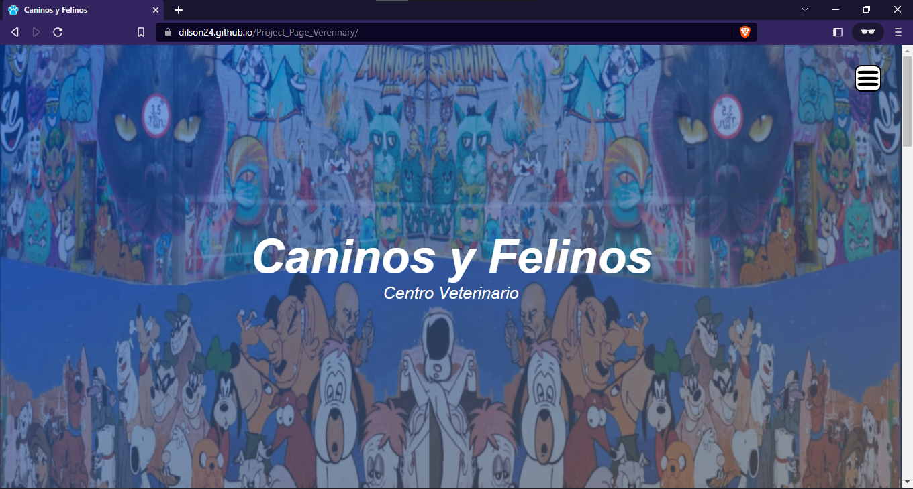
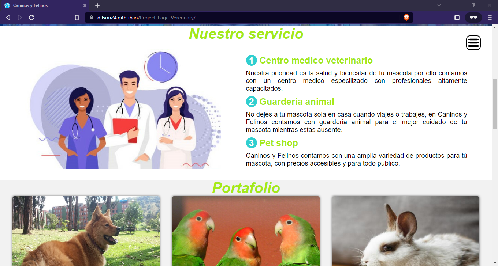
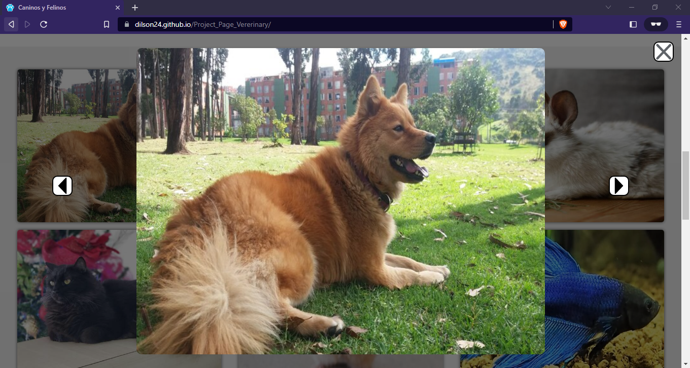
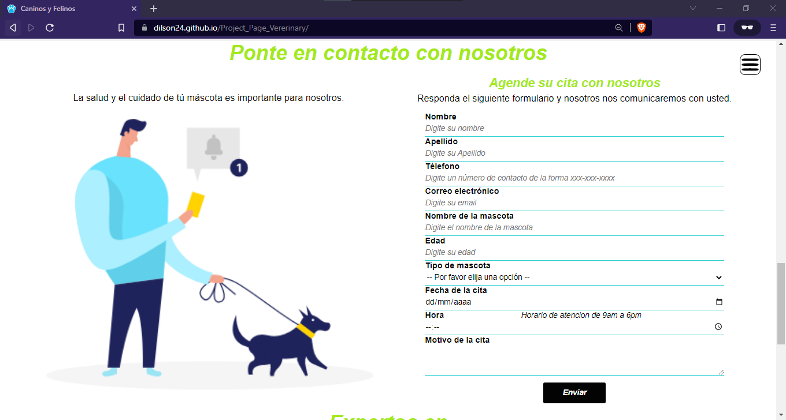
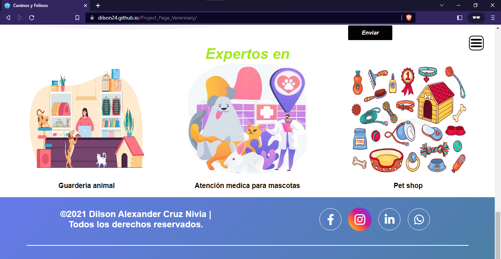

### Responsive

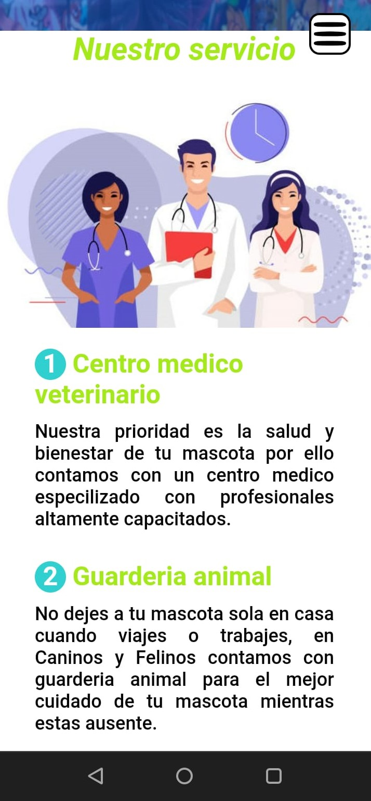
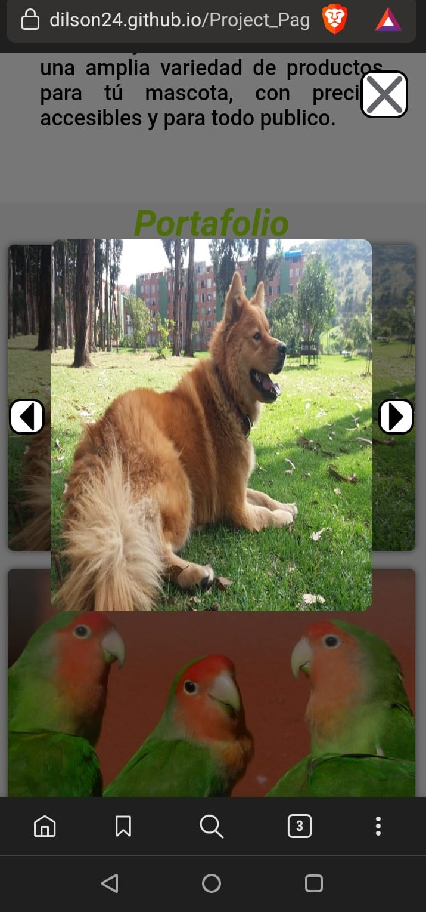
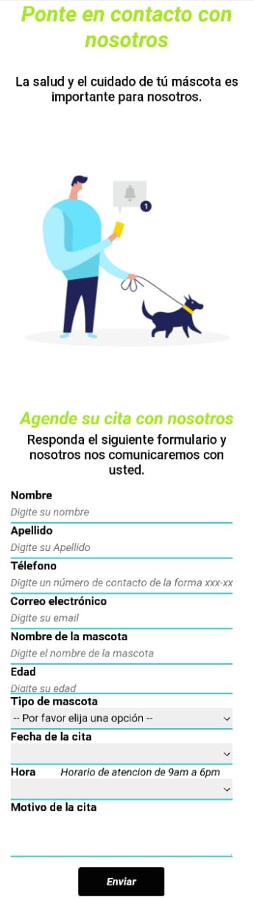
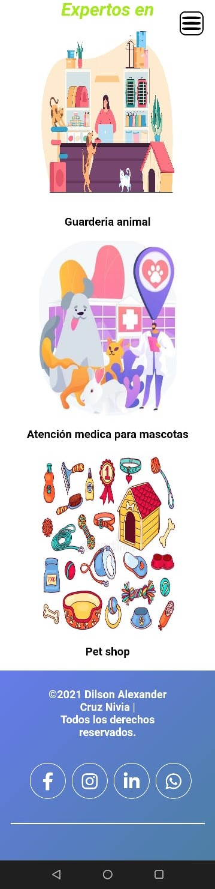

### PWA Desktop

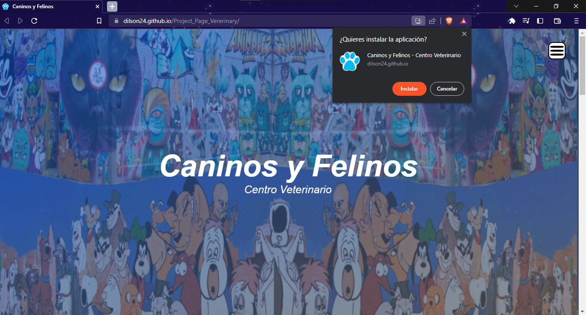
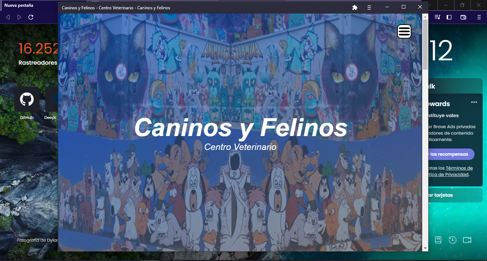

### PWA Movil

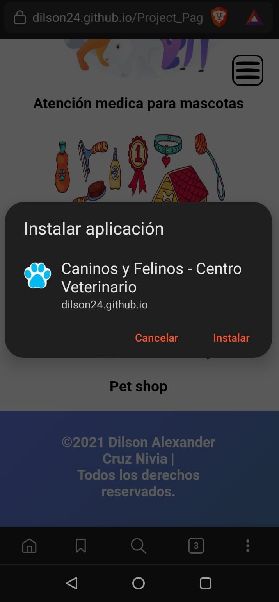
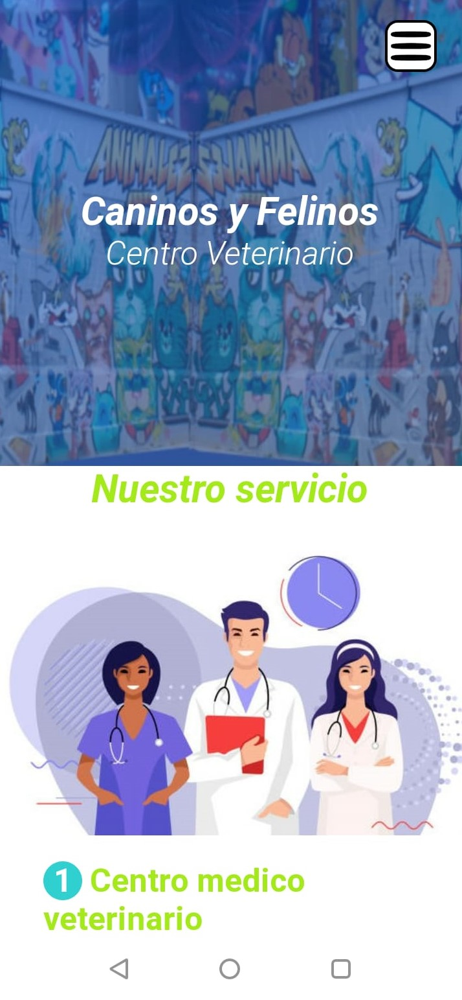

## Tech
- [HTML5] - HyperText Markup Language, versión 5.
- [CSS] - Cascading Style Sheets.
- [JavaScript] -  Interpreted programming language.
- [PWA] - Progressive web applications.

# License
**Free Software, Hell Yeah!**
[MIT](https://choosealicense.com/licenses/mit/) © 2021 - Dilson Alexander Cruz Nivia 

 [JavaScript]: <https://lenguajejs.com/>
 [HTML5]: <https://lenguajehtml.com/html/>
 [CSS]: <https://lenguajecss.com/css/>
 [PWA]: <https://web.dev/i18n/es/progressive-web-apps/>